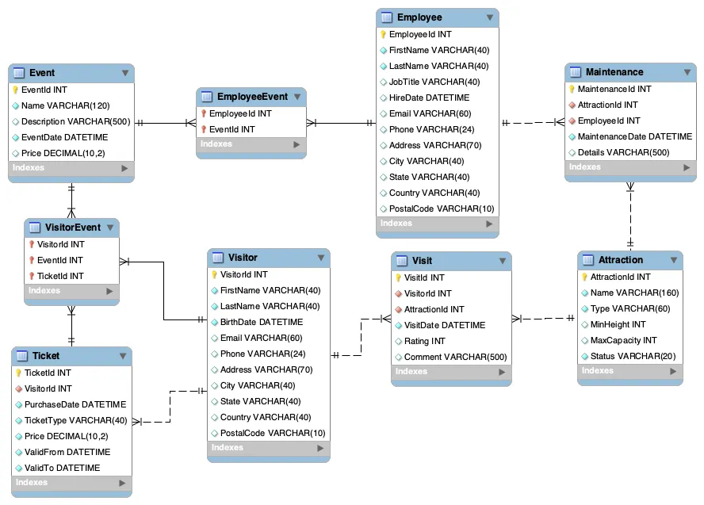

# Amusement_Park

## Diagrama UML



## Consultas

1. **Obtener todas las atracciones operativas:**

   ```sql
   SELECT
       A.Name AS Attraction,
       A.Status
   FROM
       `Attraction` A
   WHERE
       A.Status = 'Operativa';
   ```
2. **Listar todos los visitantes que se encuentran en la base de datos:**

   ```sql
   SELECT
       CONCAT(V.FirstName, ' ',V.LastName) AS Visitor
   FROM
       Visitor V;
   ```
3. **Mostrar los eventos programados junto con su precio:**

   ```sql
   SELECT 
       E.Name AS Event,, 
       E.Price 
   FROM Event E;
   ```
4. **Obtener el nombre y fecha de contratación de todos los empleados:**

   ```sql
   SELECT
       CONCAT(E.FirstName, ' ',E.LastName) AS Employee,
       E.HireDate
   FROM
       Employee E;
   ```
5. **Listar todos los boletos vendidos y su tipo:**

   ```sql
   SELECT 
       T.TicketId, 
       T.TicketType 
   FROM Ticket T;
   ```
6. **Obtener el nombre de los visitantes y las atracciones que visitaron:**

   ```sql
   SELECT
       CONCAT(v.FirstName, ' ',v.LastName) AS Visitor,
       a.Name AS Attraction
   FROM
       Visit vi
       JOIN Visitor v ON vi.VisitorId = v.VisitorId
       JOIN Attraction a ON vi.AttractionId = a.AttractionId;
   ```
7. **Listar los empleados que participaron en eventos, junto con el nombre del evento:**

   ```sql
   SELECT
       CONCAT(e.FirstName, ' ',e.LastName) AS Employee,
       ev.Name AS EventName
   FROM
       EmployeeEvent ee
       JOIN Employee e ON ee.EmployeeId = e.EmployeeId
       JOIN Event ev ON ee.EventId = ev.EventId;
   ```
8. **Mostrar los detalles de mantenimiento realizados por cada empleado, junto con la atracción:**

   ```sql
   SELECT
       CONCAT(e.FirstName, ' ',e.LastName) AS Employee,
       a.Name AS Attraction,
       m.Details
   FROM
       Maintenance m
       JOIN Employee e ON m.EmployeeId = e.EmployeeId
       JOIN Attraction a ON m.AttractionId = a.AttractionId;
   ```
9. **Obtener el nombre del visitante y la atracción que calificó junto con la puntuación:**

   ```sql
   SELECT
       CONCAT(v.FirstName, ' ',v.LastName) AS Visitor,
       a.Name AS Attraction,
       vi.Rating
   FROM
       Visit vi
       JOIN Visitor v ON vi.VisitorId = v.VisitorId
       JOIN Attraction a ON vi.AttractionId = a.AttractionId;
   ```
10. **Listar los visitantes que asistieron a eventos, con el nombre del evento:**

    ```sql
    SELECT
        CONCAT(v.FirstName, ' ',v.LastName) AS Visitor,
        e.Name AS EventName
    FROM
        VisitorEvent ve
        JOIN Visitor v ON ve.VisitorId = v.VisitorId
        JOIN Event e ON ve.EventId = e.EventId;
    ```
11. **Contar cuántas visitas ha tenido cada atracción:**

    ```sql
    SELECT
        a.Name AS Attraction,
        COUNT(vi.VisitId) AS VisitCount
    FROM
        Visit vi
        JOIN Attraction a ON vi.AttractionId = a.AttractionId
    GROUP BY
        a.Name;
    ```
12. **Obtener el precio promedio de los tickets vendidos por tipo:**

    ```sql
    SELECT
        T.TicketType,
        ROUND(AVG(T.Price)) AS AvgPrice
    FROM
        Ticket T
    GROUP BY
        T.TicketType;
    ```
13. **Contar cuántos empleados hay en cada ciudad:**

    ```sql
    SELECT
        E.City,
        COUNT(E.EmployeeId) AS EmployeeCount
    FROM
        Employee E
    GROUP BY
        E.City;
    ```
14. **Listar el total de visitantes por país:**

    ```sql
    SELECT
        V.Country,
        COUNT(V.VisitorId) AS VisitorCount
    FROM
        Visitor V
    GROUP BY
        V.Country;
    ```
15. **Obtener el número total de eventos y su precio promedio:**

    ```sql
    SELECT COUNT(EventId) AS TotalEvents, AVG(Price) AS AvgPrice 
    FROM Event;
    ```
16. **Obtener el nombre de las atracciones que tienen una capacidad máxima mayor que el promedio:**

    ```sql
    SELECT
        Name AS Attraction,
        ROUND(AVG(MaxCapacity)) as MaxCapacity
    FROM
        Attraction
    GROUP BY
        Name
    HAVING
        AVG(MaxCapacity) > (
            SELECT
                AVG(MaxCapacity)
            FROM
                Attraction
        );
    ```
17. **Listar los empleados que han trabajado en más de un evento:**

    ```sql
    SELECT
        CONCAT (e.FirstName, ' ', e.LastName) AS Employee,
        COUNT(ee.EventId) AS EventCount
    FROM
        EmployeeEvent ee
        JOIN Employee e ON ee.EmployeeId = e.EmployeeId
    HAVING
        COUNT(ee.EventId) > 1;
    ```
18. **Obtener las atracciones que no han sido visitadas en la última semana:**

    ```sql

    ```
19. **Listar los visitantes que compraron un boleto VIP:**

    ```sql
    SELECT
        CONCAT (v.FirstName, ' ', v.LastName) AS Visitor,
        t.TicketType
    FROM
        Ticket t
        JOIN Visitor v ON t.VisitorId = v.VisitorId
    WHERE
        t.TicketType = 'VIP';
    ```
20. **Mostrar los empleados cuyo salario es mayor al salario promedio (requiere la tabla `EmployeeSalary`):**
21. **Actualizar el estado de una atracción a 'En Mantenimiento'.**
22. **Eliminar visitantes que no han realizado ninguna visita.**
23. **Insertar un nuevo evento en la base de datos.**
24. **Aumentar el precio de los tickets VIP en un 10%.**
25. **Cambiar la ciudad de todos los empleados en Bogotá a Medellín.**

## Procedimentos

1. **Procedimiento para registrar una nueva visita a una atracción.**

```sql
CALL RegisterVisit(5,3,2,'2024-10-11',3);
```

2. **Procedimiento para actualizar el precio de los eventos por un porcentaje.**

```sql
CALL UpdateEventPrices(50);
```

3. **Procedimiento para eliminar eventos anteriores a una fecha específica.**

```sql
 
```

4. **Procedimiento para asignar un empleado a un evento.**

```sql
CALL AssignEmployeeToEvent(1,3);
```

5. **Procedimiento para generar un informe de visitantes y las atracciones que visitaron.**

```sql
CALL VisitorAttractionReport();
```

## Funciones

1. **Función para calcular la edad de un visitante.**

```sql
DELIMITER //

CREATE FUNCTION CalculateAge(p_BirthDate DATE)
RETURNS INT
DETERMINISTIC
BEGIN
    DECLARE v_Age INT;
    SET v_Age = TIMESTAMPDIFF(YEAR, p_BirthDate, CURDATE());
    RETURN v_Age;
END //

DELIMITER ;
```

2. **Función para obtener el precio total de los tickets vendidos en un día específico.**

```sql
DELIMITER //

CREATE FUNCTION TotalTicketsSoldOnDate(p_Date DATE)
RETURNS DECIMAL(10, 2)
DETERMINISTIC
BEGIN
    DECLARE v_Total DECIMAL(10, 2);
    SELECT SUM(Price) INTO v_Total
    FROM Ticket
    WHERE PurchaseDate = p_Date;
    RETURN v_Total;
END //

DELIMITER ;
```

3. **Función para calcular el precio promedio de los tickets VIP.**

```sql
DELIMITER //

CREATE FUNCTION AverageVIPTicketPrice()
RETURNS DECIMAL(10, 2)
DETERMINISTIC
BEGIN
    DECLARE v_AveragePrice DECIMAL(10, 2);
    SELECT AVG(Price) INTO v_AveragePrice
    FROM Ticket
    WHERE TicketType = 'VIP';
    RETURN v_AveragePrice;
END //

DELIMITER ;
```

4. **Función para obtener la capacidad total de todas las atracciones operativas.**

```sql
DELIMITER //

CREATE FUNCTION TotalOperationalCapacity()
RETURNS INT
DETERMINISTIC
BEGIN
    DECLARE v_TotalCapacity INT;
    SELECT SUM(MaxCapacity) INTO v_TotalCapacity
    FROM Attraction
    WHERE Status = 'Operativa';
    RETURN v_TotalCapacity;
END //

DELIMITER ;
```

5. **Función para verificar si un visitante tiene al menos una visita registrada.**

```sql
DELIMITER //

CREATE FUNCTION HasVisits(p_VisitorId INT)
RETURNS BOOLEAN
DETERMINISTIC
BEGIN
    DECLARE v_Count INT;
    SELECT COUNT(*) INTO v_Count
    FROM Visit
    WHERE VisitorId = p_VisitorId;
    RETURN v_Count > 0;
END //

DELIMITER ;
```

## Eventos programados

1. **Evento programado para actualizar el estado de las atracciones a 'En Mantenimiento' todos los lunes.**

```sql
DELIMITER //

CREATE EVENT WeeklyMaintenanceUpdate
ON SCHEDULE EVERY 1 WEEK
STARTS '2024-10-14 00:00:00'
DO
    UPDATE Attraction
    SET Status = 'En Mantenimiento'
    WHERE Status = 'Operativa' AND DAYOFWEEK(CURDATE()) = 2;  -- 2 es lunes

DELIMITER ;
```

2. **Evento programado para eliminar boletos antiguos que no han sido utilizados.**

```sql
DELIMITER //

CREATE EVENT RemoveOldUnusedTickets
ON SCHEDULE EVERY 1 MONTH
DO
    DELETE FROM Ticket
    WHERE PurchaseDate < CURDATE() - INTERVAL 1 YEAR
    AND TicketId NOT IN (SELECT TicketId FROM Visit);

DELIMITER ;
```

3. **Evento programado para enviar un reporte semanal de visitas a los administradores (simulación con impresión en consola).**

```sql
DELIMITER //

CREATE EVENT WeeklyVisitorReport
ON SCHEDULE EVERY 1 WEEK
STARTS '2024-10-15 08:00:00'
DO
BEGIN
    -- Simulación de generación de reporte con SELECT (normalmente esto sería enviado por correo o guardado en un archivo)
    SELECT v.FirstName, v.LastName, COUNT(vis.VisitId) AS TotalVisits
    FROM Visit vis
    JOIN Visitor v ON vis.VisitorId = v.VisitorId
    GROUP BY v.VisitorId;
END //

DELIMITER ;
```

4. **Evento programado para aumentar el precio de los tickets en temporada alta (cada diciembre).**

```sql
DELIMITER //

CREATE EVENT HighSeasonTicketPriceIncrease
ON SCHEDULE EVERY 1 YEAR
STARTS '2024-12-01 00:00:00'
DO
    UPDATE Ticket
    SET Price = Price * 1.15
    WHERE TicketType IN ('General', 'VIP');

DELIMITER ;
```

5. **Evento programado para restablecer las atracciones operativas al final del día.**

```sql
DELIMITER //

CREATE EVENT ResetAttractionStatus
ON SCHEDULE EVERY DAY
STARTS '2024-10-10 23:59:59'
DO
    UPDATE Attraction
    SET Status = 'Operativa'
    WHERE Status = 'En Mantenimiento';

DELIMITER ;
```
